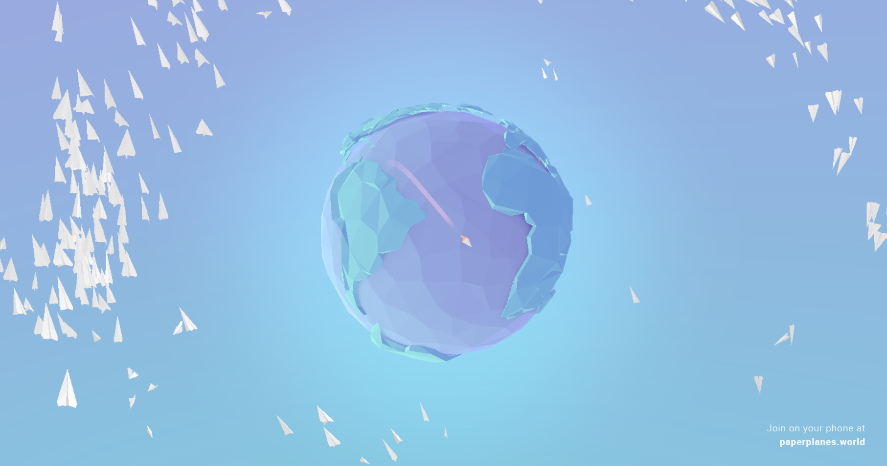
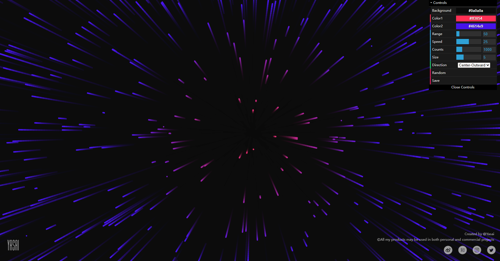
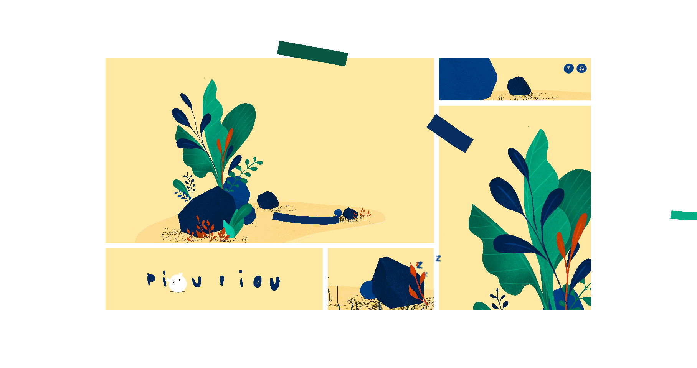
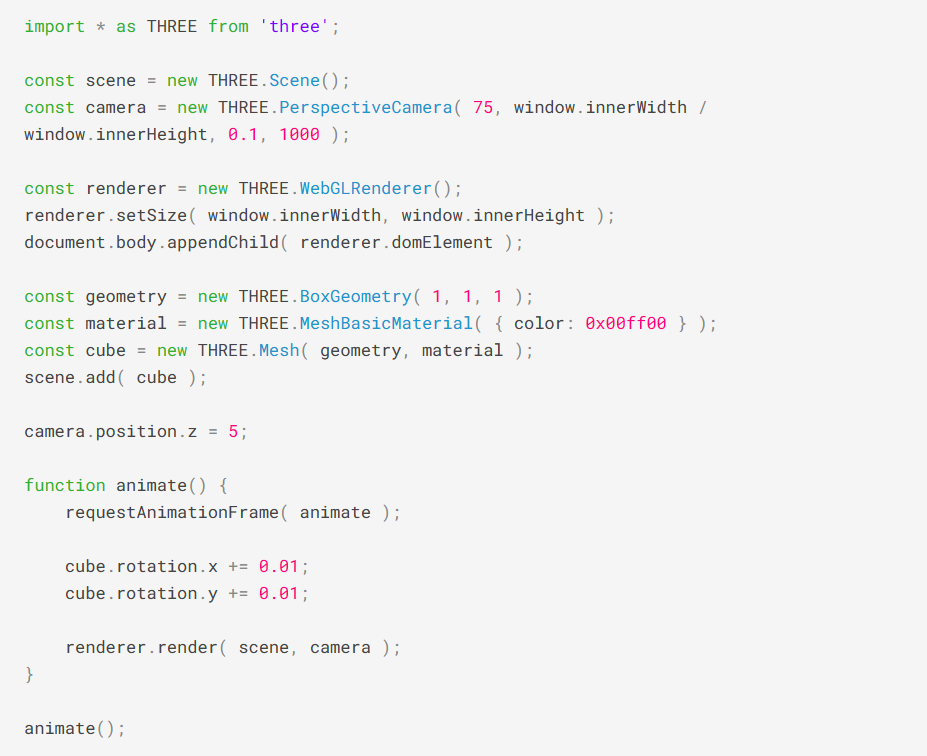
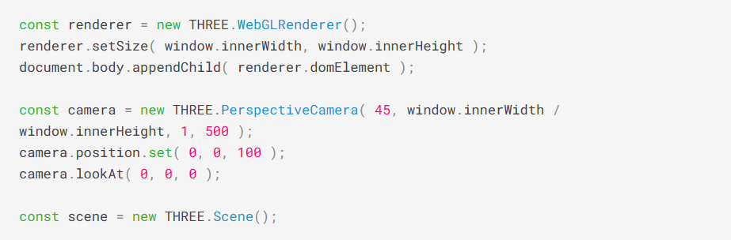

### inspiration

1. using P5.js & three.js imaging technology，to create an interactive work.
2. Here, it is like an interactive action to switch the earth in the picture to the specific interaction I want to show in detail. When the screen is switched to close range, there is a quick shuttle effect to experience the feeling of teleportation.
3. 

### coding exploration

1. coding technique：P5.js & three.js
2. three.jsIt is easy to use, cross-platform compatibility, high performance, a wealth of tools and plug-ins can help me make it quickly, and there is a wealth of cases for me to refer to.
3. 

4. coding link

   ​		tech link

   - https://threejs.org/

     case link

   - https://paperplanes.world/

   - https://wangyasai.github.io/Stars-Emmision/

   - https://pioupiou.wmapan.com/
